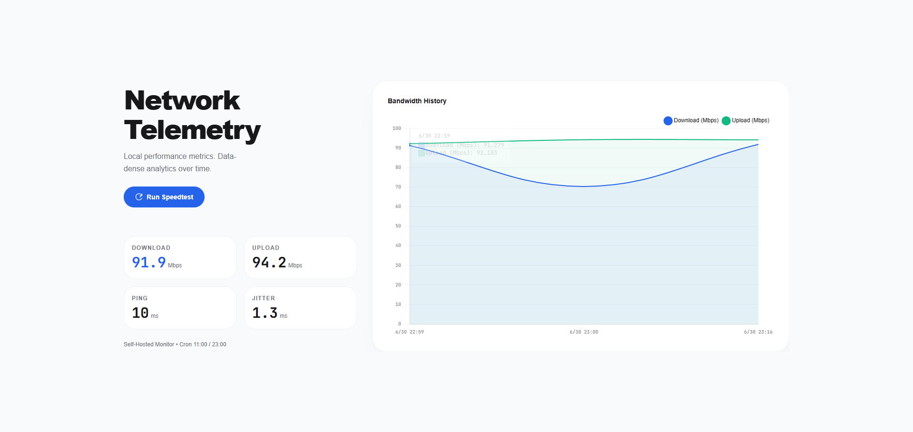

# 🌍 Internet Quality Monitor


> **A self-hosted, universal Internet Quality Monitoring Web App that randomly tests and tracks your connection speed over time.**

<p align="center">
  
</p>

## ✨ Key Features
- **Data-Dense Analytics**: Track Download, Upload, Ping, and Jitter on a beautiful, responsive, one-page dashboard.
- **Randomized Automation**: Automatically tests your internet speed at two completely random times every day (one AM, one PM) using the official Ookla CLI to prevent predictable ISP throttling.
- **Universal Deployment (Docker)**: Designed to run flawlessly on any OS (Windows, Mac, Linux, Raspberry Pi) via Docker, without needing manual CLI installations.
- **Premium UI**: Powered by Tailwind CSS, Chart.js, and Stitch Design Taste principles.

---

## 🚀 Getting Started / Installation

### 🐳 The Universal Way (Recommended)
Because the `speedtest` CLI varies by operating system, the easiest way to run this universally is via **Docker**. This is perfect for local servers, NAS devices, or a Raspberry Pi.

```bash
# 1. Clone the repository
git clone https://github.com/c-onfused69/internet-monitor.git
cd internet-monitor

# 2. Start the container in the background
docker-compose up -d
```
That's it! The database is mounted as a volume so your history persists. Access the dashboard at `http://localhost:8000`.

### 💻 The Manual Way (Local Python)
If you prefer to run it manually:

1. **Install Prerequisites:**
   - Python 3.10+
   - Download and install the [Ookla Speedtest CLI](https://www.speedtest.net/apps/cli) for your OS and ensure `speedtest` is in your `PATH`. *(Note: Do NOT install `speedtest-cli` via pip!)*

2. **Run the App:**
   ```bash
   # Install dependencies
   pip install -r requirements.txt
   
   # Run the server
   cd backend
   uvicorn main:app --host 0.0.0.0 --port 8000
   ```

---

## 🛠️ Tech Stack
| Component | Technology |
| :--- | :--- |
| **Backend** | Python, FastAPI, APScheduler |
| **Database** | SQLite3 |
| **Frontend** | HTML5, Tailwind CSS (CDN), Chart.js |
| **Speedtest Engine**| Official Ookla CLI |

---

## 📫 Contact / Connect
Have questions or want to contribute?
- **GitHub**: [github.com/c-onfused69](https://github.com/c-onfused69)
- **Twitter**: [@c-onfused69](https://twitter.com/c-onfused69)
